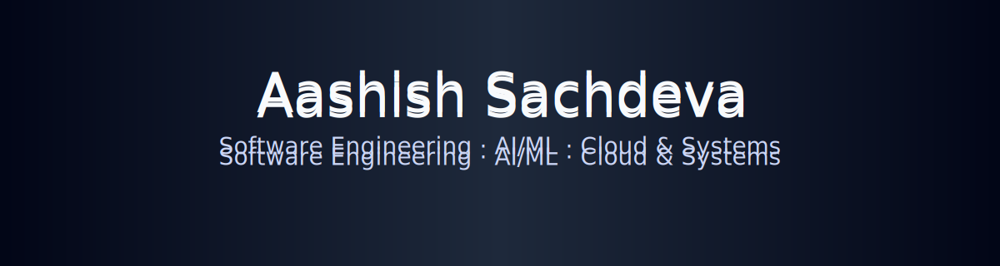

  

<h1 align="center">Aashish Sachdeva</h1>

  Software Engineer · Systems Thinker · Builder of Scalable Products

  <a href="https://www.linkedin.com/in/aashish-sachdeva-6b1943281">LinkedIn</a> ·
  <a href="https://github.com/Asachdeva001">GitHub</a> ·
  <a href="https://aashish-sachdeva.vercel.app/">Portfolio</a> ·
  <a href="mailto:ashisach001@gmail.com">Email</a>

## Overview

I am a Computer Science undergraduate at **Punjab Engineering College, Chandigarh**, focused on building **reliable, scalable, and performance-driven software systems**.

My work spans **full-stack engineering, cloud-native architectures, and data-informed product development**, with an emphasis on clean abstractions, measurable impact, and long-term maintainability.

## Experience Highlights

### Full Stack Web Developer Intern — Growero.io
- Improved system reliability by optimizing asynchronous API workflows
- Reduced initial page load time by **40%** through frontend performance tuning
- Designed and implemented **secure authentication flows (SSO + email/password)**
- Led CI/CD adoption using **GitHub Actions**, reducing release cycles by **25%**

### Web Developer — E-Summit’25 (PEC)
- Built and deployed a high-traffic platform supporting **800+ concurrent users**
- Achieved **99.9% uptime** with sub-1.2s load times during peak usage
- Improved user engagement by **25%** through navigation and UX redesign

### Frontend Developer Intern — WebInOrbit
- Developed analytics dashboards using **React + TailwindCSS**
- Reduced design iteration cycles by **18%** via improved UI precision
- Actively contributed to code reviews and refactoring initiatives

## Flagship Projects

### Mental Health AI Companion
- Designed an AI-driven conversational system to infer emotional states and stress signals
- Iteratively improved classification performance using feature refinement and evaluation metrics
- Translated model insights into user-facing dashboards with a focus on explainability and trust

### Noteflow — Productivity Platform
- Built a real-time notes and task management system with Firebase synchronization
- Achieved sub-800ms load times with persistent cross-session data integrity
- Designed for responsive, cross-platform usage using Material-UI

## Technical Foundation

**Languages**  
JavaScript · Python · C++

**Frameworks & Platforms**  
React · Next.js · MERN · Flask · TailwindCSS

**Databases & Systems**  
MongoDB · MySQL · Redis · REST APIs

**Cloud & DevOps**  
GCP · AWS (Cloud Practitioner) · Docker · GitHub Actions

**CS Fundamentals**  
Data Structures · Algorithms · OOP · System Design

## Engineering Philosophy

I optimize for:
- Clarity over cleverness
- Systems that evolve without breaking
- Metrics-driven decisions
- Long-term product and engineering value

More details → [philosophy.md](philosophy.md)

## Activity

  

  

