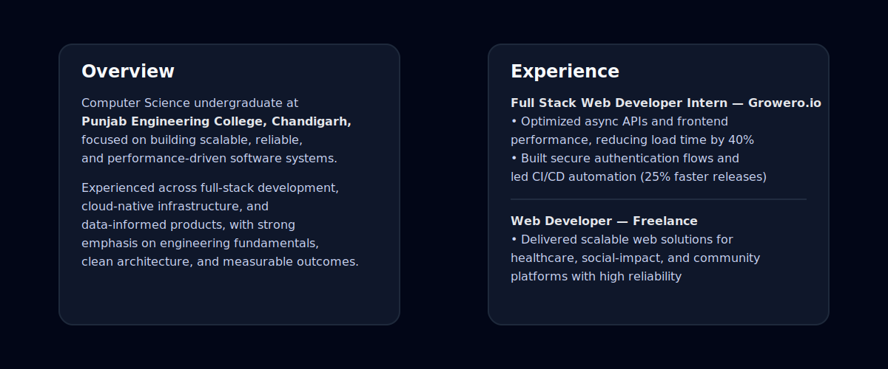

  

  <a href="https://www.linkedin.com/in/aashish-sachdeva-6b1943281" target="_blank">LinkedIn</a> ·
  <a href="https://github.com/Asachdeva001" target="_blank">GitHub</a> ·
  <a href="https://aashish-sachdeva.vercel.app/" target="_blank">Portfolio</a> ·
  <a href="mailto:ashisach001@gmail.com">Email</a>

  

## Tech Foundation

  

## Activity

  

  

---

  Profile overview above · Engineering activity below

